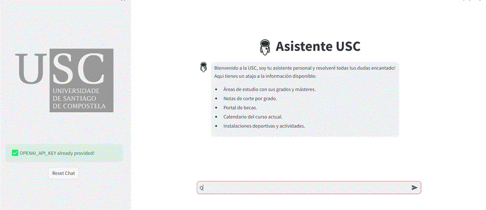

# 🤖 Asistente USC

Bienvenidos al [Asistente de la Universidad de Santiago de Compostela](https://usc-assistant.streamlit.app/)

  

## Características principales:
- Proporciona información sobre los **estudios** que ofrece la universidad.
- Facilita enlaces a las **becas** de estudio.
- Ofrece información de los cursos de **idiomas** disponibles
- Da información referente a **actividades deportivas**.
  
A estas se le irán sumando más con el tiempo.  

Veamos un ejemplo de uso:
---

  
   
  Información sobre cursos de idiomas

  

